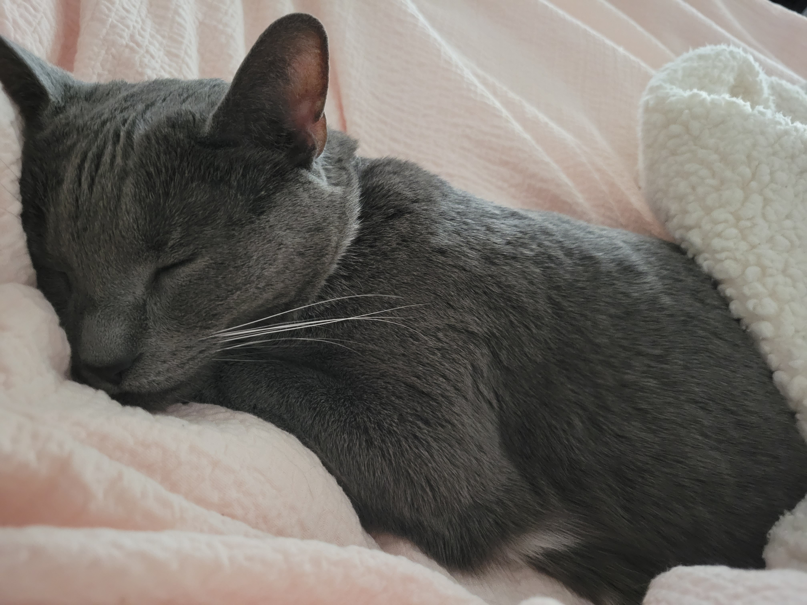

# HelloWorld

Welcome to my project for DATA 410. In this project, I will include some pictures, math equations, markdown, and python code. Enjoy!

## Below are picture of my 3 cats.

### Stormy

### Bella

### Happy


## Markdown
```
  Lists
  1. one
  2. two
  3. three
  
  Emphasis
  
  **This is bold text**
  
  __This is bold text__
  
  *This is italic text*
  
  _This is italic text_
  
  ~~Strikethrough~~
  
  Table
  
  | Cats   | Description |
  | ------ | ----------- |
  | Stormy | Youngest. Full of energy and likes to mess around. Stays by the garage door to sneak out when it opens.|
  | Bella  | 2nd oldest. Used to be like Stormy. Now likes to sleep on top of air vents.|
  | Happy  | Eldest. Follows my dad everywhere. Hard to find since she's always sleeping.|
```
## Math Equations

&plus;sin(x%5E%7B5%7D)&plus;%5Cpi%7D)

## Python Code
```
  import matplotlib.pyplot as plt
  plt.plot([1,2,3,4])
  plt.show()
```
